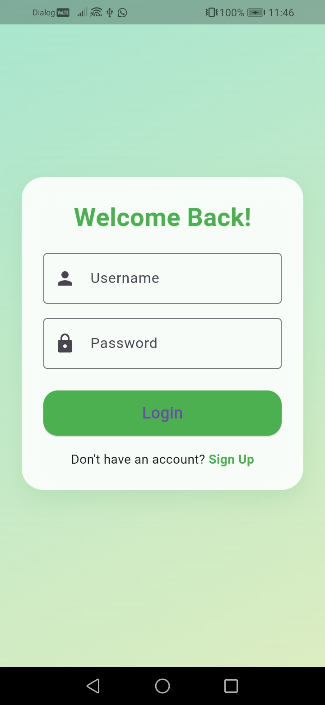
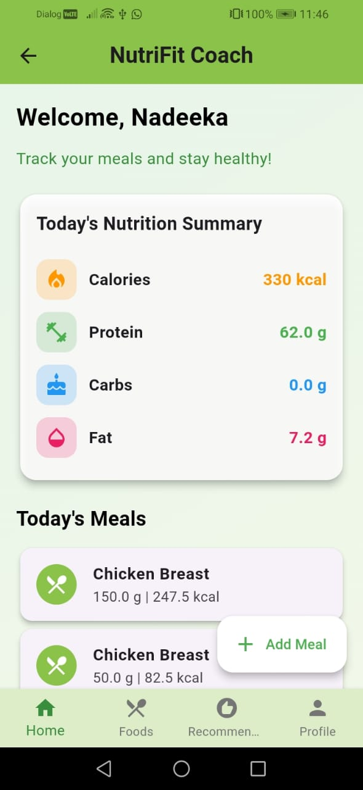
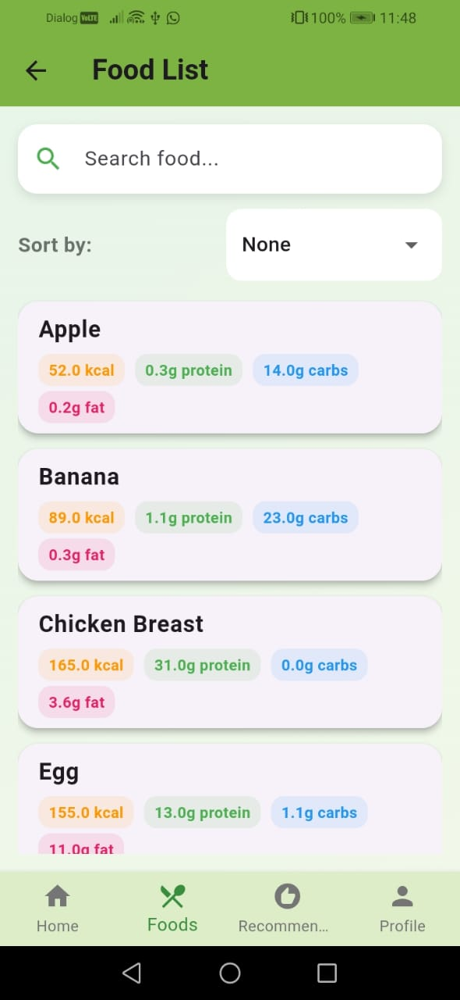
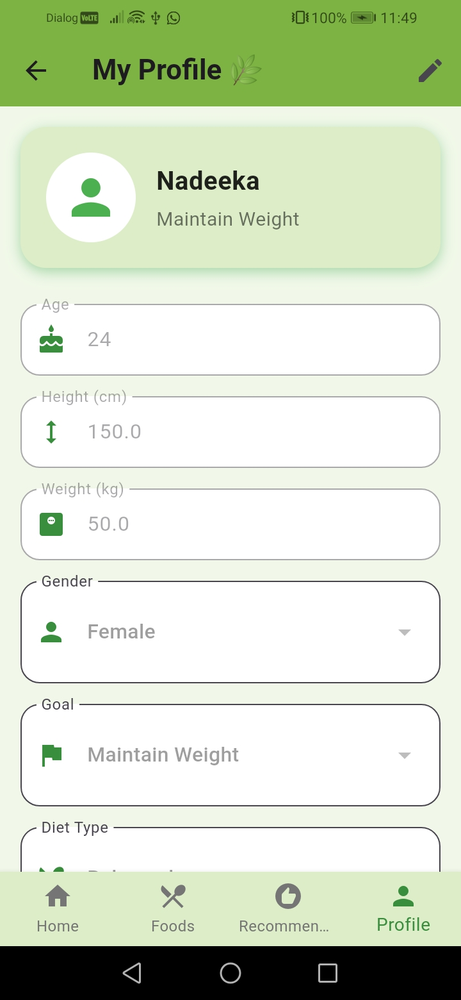
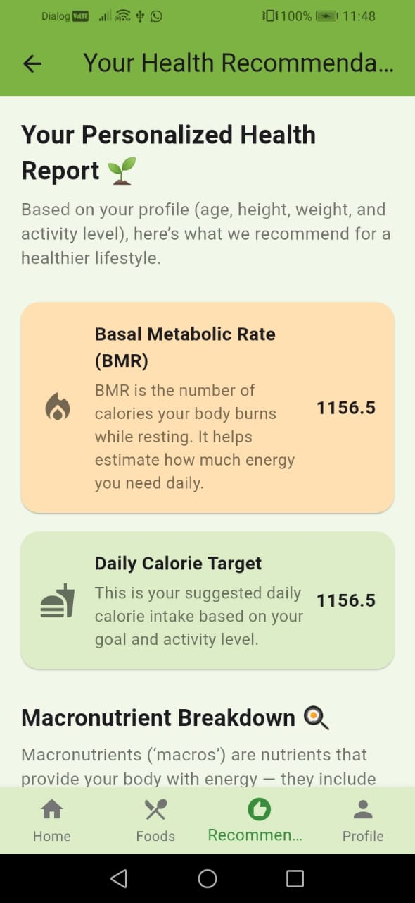

# 🥗 NutriFit Coach – Flutter Frontend

A modern and responsive **Flutter-based mobile app frontend** for the **NutriFit Coach** platform — designed to help users track meals, monitor nutrition, and achieve fitness goals with a smooth and attractive UI.

---

## 🚀 Features

**User Authentication**
- Signup, login, and logout functionality  
- JWT-based secure session handling  

**Meal Management**
- Add and log meals with nutritional details  
- View daily meal summaries (calories, protein, carbs, fats)  

**Smart UI**
- Clean green-themed gradient design  
- Mobile-friendly layout and smooth navigation  
- Integrated with RESTful backend API  

**Flutter Integration**
- Uses `flutter_typeahead` for intelligent food name suggestions  
- Communicates seamlessly with a Spring Boot backend via `ApiService`

---

## 🛠️ Tech Stack

| Category | Technology |
|-----------|-------------|
| **Frontend Framework** | Flutter (Dart) |
| **API Communication** | RESTful API |
| **State Management** | setState / FutureBuilder |
| **UI Components** | Material Design |
| **Backend (connected)** | Spring Boot + MySQL |
| **Version Control** | Git & GitHub |

---

## 📸 Screenshots


```markdown






